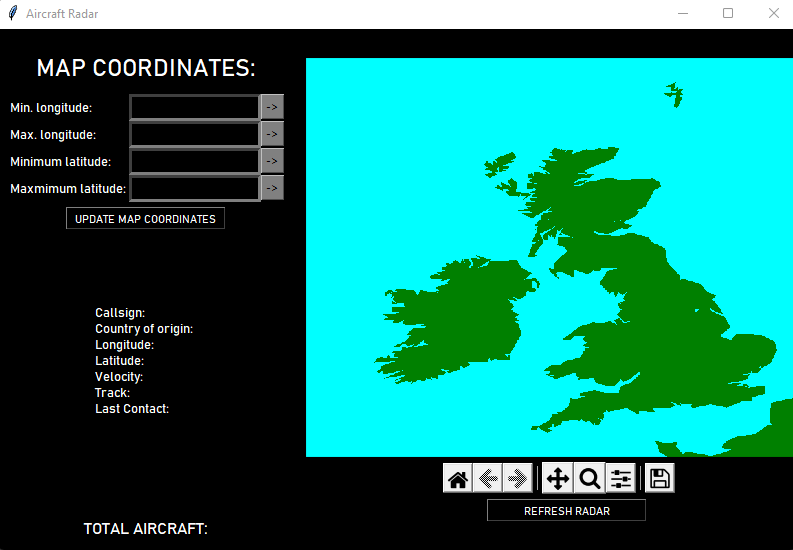
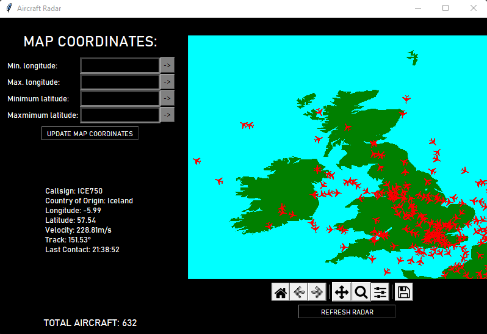
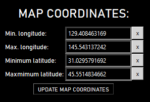
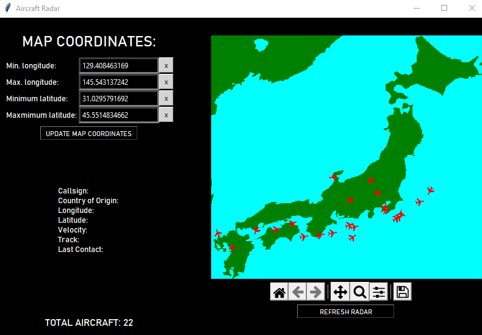

# Aircraft Radar
A tkinter GUI which displays a radar of aircraft in a specified region using data pulled from the [OpenSky Network  API](https://openskynetwork.github.io/opensky-api/?ref=devresourc.es?ref=devresourc.es?ref=devresourc.es). It offers user interaction such as customisable map coordinates and the ability to show information about a specific aircraft on the radar selected by the user.
## Requirements
- Python 3.8.5 or higher.
- Libraries: [requirements.txt](requirements.txt).
## Installation
1) Create a virtual environment and activate it.
2) Download the aircraft-radar package.
3) _pip install -r requirements.txt_
## Using the GUI
Once the package is installed, run [main.py](main.py) and you should be able to see what is shown in the image below.

This is the GUI in its default implementation. By default the radar is set to a map showing a region around the UK and Ireland. From here on, it is up to the user to get what they want from the radar.

The refresh radar button pulls the most recent data from the API and updates the radar. New data from the OpenSky Network API is available every 10 seconds. Above this button is the default matplotlib toolbar which allows for user interaction with the map figure.

Shown above is what you should be able to see from the GUI once the radar is updated. The total number of aircraft within the region is also displayed in the bottom left corner.

For more information about specific aircraft on the radar, simply click on one of the red aircraft icons. The text box on the left will update with relevant information about the chosen aircraft.

You are also able to customise the radar to show a different country or region of the world. Simply input the minimum and maximum longitudes and latitudes of the bounding box around the region you wish to see, selecting each grey arrow button once to confirm your input. To clear your input, simply click on the button again.

Once all four buttons have been selected, press the update map coordinates button to see the changes.
As an example, lets change the radar from its default box over the UK and Ireland, to a box around Japan.

We have typed the appropriate coordinates for a bounding box around Japan and have selected each button to input the coordinates. Now we are ready to click the update map coordinates button.

And there we have it, the radar will now show aircraft currently flying over Japan.

## Coordinates

- These must conform to WSG84.
- See [country-bounding-boxes](https://gist.github.com/graydon/11198540) for a useful list of bounding box coordinates for all of the countries in the world.

